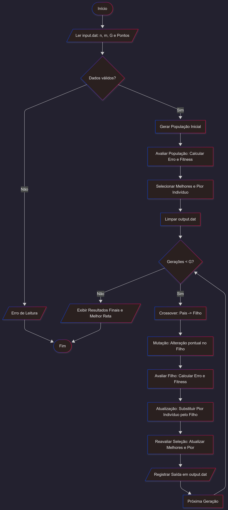

# <h1 align="center"> Otimizador Genético Linear </h1>

## :page_with_curl: Introdução

<p align="justify">
O ajuste de curvas e a regressão linear é um problema de otimização: o objetivo é encontrar os parâmetros de uma função matemática que melhor descrevam um conjunto de dados observados. O uso de uma meta-heurística evolutiva permite que o computador "aprenda" os melhores coeficientes através de sucessivas gerações de tentativas, erros, cruzamentos e mutações, aproximando-se gradativamente da reta ideal que minimiza as distâncias para os pontos do conjunto de dados.
</p>

## :bookmark_tabs: Descrição do Projeto

<p align="justify">
Este projeto implementa um Algoritmo Genético (AG) procedural em C++ com o objetivo de ajustar uma função afim $\hat{y} = ax + b$ a um conjunto de pontos bidimensionais $(x, y)$. A população de soluções candidatas é gerenciada por meio de vetores dinâmicos da STL (<code>std::vector</code>). Cada indivíduo carrega em seu "DNA" os genes $a$ e $b$, e sua aptidão é avaliada iterativamente com base no Erro Quadrático Médio (MSE) em relação ao dataset fornecido.
</p>

<p align="justify">
Além do cálculo matemático de ajuste, o projeto implementa o ciclo evolutivo completo, passando pelas fases de avaliação de aptidão (<em>fitness</em>), seleção dos mais aptos, reprodução (<em>crossover</em>) e mutação genética para garantir a exploração contínua do espaço de soluções.
</p>

<p align="justify">
Este trabalho foi proposto pelo professor Michel Pires Silva, instrutor da disciplina Algoritmos e Estrutura de Dados I, do Centro Federal de Educação Tecnológica de Minas Gerais (CEFET-MG), Campus V — Divinópolis.
</p>

---

### :pushpin: 1. Representação da População

<p align="justify">
A população de soluções candidatas é representada por um <code>std::vector&lt;Individuo&gt;</code> de tamanho $m$, onde cada elemento é uma estrutura com os seguintes atributos:
</p>

- **Gene `a`**: Coeficiente angular da reta candidata.
- **Gene `b`**: Coeficiente linear (intercepto) da reta candidata.
- **Erro**: Discrepância média calculada entre a reta do indivíduo e os pontos reais (MSE).
- **Fitness**: Valor de aptidão inversamente proporcional ao erro $\left(\frac{1}{\text{erro} + \varepsilon}\right)$, onde $\varepsilon$ é uma constante pequena para evitar divisão por zero.

---

### :pushpin: 2. Simulação do Processo Evolutivo

<p align="justify">
A evolução da população ocorre de forma iterativa ao longo de $G$ gerações, seguindo regras biológicas adaptadas para o contexto matemático.
</p>

#### 2.1 Regras de Propagação

<p align="justify">
A cada iteração, toda a população é avaliada e os dois indivíduos com maior fitness são selecionados (Pai 1 e Pai 2). O cruzamento genético ocorre por sorteio: para cada gene ($a$ e $b$), sorteia-se aleatoriamente de qual pai ele será herdado, gerando uma nova solução candidata (Filho).
</p>

#### 2.2 Mutação Genética

<p align="justify">
Para evitar a convergência prematura (estagnação evolutiva), o Filho recém-criado sofre uma mutação controlada. Um valor estocástico $\delta$ entre $-1{,}0$ e $+1{,}0$ é somado a um dos parâmetros do indivíduo, sorteado aleatoriamente entre $a$ e $b$. Isso simula uma adaptação ambiental e garante a exploração de novas regiões do espaço de soluções.
</p>

#### 2.3 Regras de Substituição

<p align="justify">
Após a geração e avaliação do Filho, o indivíduo com o pior desempenho (menor fitness) da população é eliminado e substituído pelo novo descendente. O processo se repete por $G$ gerações.
</p>

---

## 🖥️ Ambiente de Criação

O código foi desenvolvido utilizando as seguintes ferramentas:

[](https://learn.microsoft.com/cpp/)
[](https://code.visualstudio.com/)
[](https://www.linux.org/)

---

## :file_folder: Estrutura Geral do Projeto

```text
Algoritmo-Genetico/
├── Makefile                # Script para automação da compilação
├── README.md               # Documentação principal do projeto
├── src/                    # Código-fonte das implementações (C++)
│   ├── main.cpp            # Ponto de entrada e ciclo evolutivo principal
│   └── utils.cpp           # Implementação das rotinas do algoritmo
├── include/                # Arquivos de cabeçalho
│   ├── utils.hpp           # Declarações das funções auxiliares
│   └── types.hpp           # Definição das estruturas de dados
└── data/                   # Diretório de dados operacionais
    ├── input.dat           # Arquivo de entrada (parâmetros e coordenadas)
    └── output.dat          # Relatório gerado com os resultados por geração
```

---

## 👨‍💻 Implementação

<p align="justify">
O fluxo de execução do Otimizador Genético segue um ciclo contínuo de avaliação e evolução. A implementação foi estruturada de forma modular, separando as responsabilidades entre os arquivos <code>main.cpp</code>, <code>utils.cpp</code> e os respectivos cabeçalhos.
</p>

O processo funciona através das seguintes etapas principais:

1. **Inicialização:** Os dados são lidos do arquivo `input.dat`. A população inicial é gerada com valores aleatórios para os genes `a` e `b`, dentro do intervalo $[-100{,}0;\; +99{,}9]$.
2. **Avaliação (Fitness):** O programa calcula o Erro Quadrático Médio (MSE) de cada indivíduo em relação aos $n$ pontos do dataset. Quanto menor o erro, maior a aptidão.
3. **Seleção:** Os dois indivíduos com maior fitness são selecionados como pais para a reprodução (elitismo).
4. **Crossover:** O Filho é gerado combinando os genes dos dois pais por sorteio independente para cada parâmetro.
5. **Mutação:** O Filho sofre uma pequena perturbação estocástica $\delta$ em um de seus genes para garantir diversidade.
6. **Substituição:** O Filho avaliado substitui o pior indivíduo da população. O ciclo se repete até atingir $G$ gerações.

<details>
  <summary><b>Clique aqui para visualizar o Fluxograma do Algoritmo</b></summary>

  <div align="center">
    
  </div>

</details>

---

## 💬🎯 Análises e Conclusões

<p align="justify">
A validação da modelagem foi realizada observando o log gerado em <code>output.dat</code>. Nas gerações iniciais, o erro apresenta grande oscilação, refletindo retas candidatas distribuídas aleatoriamente pelo espaço de soluções. No entanto, devido à estratégia de substituição do pior indivíduo e ao elitismo na seleção, a população converge progressivamente para parâmetros que minimizam o MSE.
</p>

<p align="justify">
Observou-se que a mutação é o motor secundário essencial da busca: sem uma variação $\delta$ bilateral (positiva e negativa) aplicada de forma estocástica, os filhos gerados pelo crossover elitista poderiam convergir prematuramente para um mínimo local, nunca alcançando o menor Erro Quadrático Médio possível.
</p>

### Análise Assintótica

A eficiência do Algoritmo Genético depende da dimensão da população ($m$), da quantidade de pontos do dataset ($n$) e do número de gerações ($G$).

- A função `testarPopulacao` em `utils.cpp` possui complexidade $O(m \times n)$, pois avalia cada um dos $m$ indivíduos iterando pelos $n$ pontos do dataset.
- A função `selecionarIndividuos` percorre a população uma única vez, custando $O(m)$.
- As operações de `crossover`, `mutacao` e `varrerFilho` possuem impacto constante de tempo, $O(1)$ e $O(n)$, respectivamente.
- O espaço de memória consumido é $O(m + n)$, refletindo o vetor da população e o vetor do dataset.

| **Operação**             | **Tempo (Pior Caso)**                          | **Espaço (Memória)** |
|--------------------------|------------------------------------------------|----------------------|
| `testarPopulacao()`      | $O(m \times n)$                                | $O(1)$               |
| `selecionarIndividuos()` | $O(m)$                                         | $O(1)$               |
| `varrerFilho()`          | $O(n)$                                         | $O(1)$               |
| `crossover()` e `mutacao()` | $O(1)$                                      | $O(1)$               |
| **Total (Global)**       | $O(G \times (m \times n + m))$                 | $O(m + n)$           |

**Legenda:**
- **G**: Número total de gerações.
- **m**: Tamanho da população.
- **n**: Quantidade de pontos do dataset.

---

## :keyboard: Instalação e Configuração

Para a execução correta do software, é recomendado o seguinte ambiente:

- Compilador C++ (`g++`, com suporte a C++11 ou superior)
- Utilitário `make` para *build*
- Ambiente Linux (Ubuntu/Debian)

### Passos e Comandos

#### 1. Clone o repositório
```bash
git clone https://github.com/HeitorHenriqueZ/algoritmo-genetico-regressao.git
```

#### 2. Acesse o diretório do projeto
```bash
cd algoritmo-genetico-regressao
```

#### 3. Arquivo de Dados (`input.dat`)

Certifique-se de que existe um arquivo `input.dat` dentro da pasta `data/` com o seguinte formato — primeira linha com os parâmetros $n$, $m$ e $G$, seguida das coordenadas $x$ e $y$:

```text
5 20 100
1.0 3.1
2.0 4.9
3.0 7.2
4.0 9.8
5.0 12.1
```

#### 4. Compilar o projeto
```bash
make
```
> Para forçar uma recompilação limpa: `make clean` seguido de `make`.

#### 5. Executar o projeto
```bash
make run
```

A execução lerá os dados e gerará imediatamente o arquivo **`data/output.dat`** contendo os indicadores de evolução para cada geração processada.

---

## 👥 Desenvolvedor do Projeto

<div align="center">
  <a href="https://github.com/HeitorHenriqueZ">
    
  </a>
  <br>
  <strong>Heitor Henrique Zonho</strong>
  <br>
  Estudante de Engenharia de Computação no CEFET-MG.
</div>

---

## :computer: Ambiente de Teste

Este projeto foi executado e validado no seguinte setup:

- Processador: Intel Core i3-9100F

- Memória RAM: 16GB DDR4 (Single Channel)

- Placa de Vídeo: NVIDIA GeForce GTX 1050 Ti

- Placa Mãe: Gigabyte H310M H 2.0

- Sistema Operacional: Linux 

---

## ⚙️ Recursos Utilizados

<p align="left">
  
  
</p>
